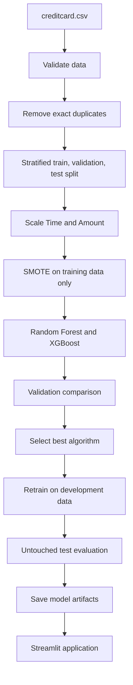

# Credit Card Fraud Detection

## Overview

This project detects potentially fraudulent credit card transactions using machine learning. It handles severe class imbalance with SMOTE, compares Random Forest and XGBoost on a validation set, retrains the selected algorithm on combined development data, and evaluates it once on an untouched final test set.

A Streamlit application supports single-transaction prediction, batch CSV prediction, fraud scores, prediction statistics, and downloadable results.

> This is an educational machine learning project and not a production banking decision system.

## Problem Statement

Credit card fraud detection is an imbalanced classification problem because fraudulent transactions are extremely rare compared with normal transactions. A model that predicts almost every transaction as normal can achieve high Accuracy while missing important fraud cases.

For this reason, the project gives greater attention to Precision, Recall, F1 Score, and ROC-AUC. A false negative is especially important because it represents an actual fraudulent transaction predicted as normal.

## Dataset

- **Dataset:** Credit Card Fraud Detection
- **Source:** [Kaggle — mlg-ulb/creditcardfraud](https://www.kaggle.com/datasets/mlg-ulb/creditcardfraud)
- **Local filename:** `creditcard.csv`
- **Original shape:** 284,807 rows × 31 columns
- **Input features:** `Time`, `V1`–`V28`, and `Amount`
- **Target:** `Class`
- **Class 0:** Normal transaction
- **Class 1:** Fraudulent transaction
- **Original normal records:** 284,315
- **Original fraud records:** 492
- **Missing values:** 0
- **Exact duplicate rows:** 1,081

`V1` to `V28` are anonymized PCA-derived numerical features. Their original business meanings are not available. `Time` and `Amount` are the remaining numerical input features.

Exact duplicates are removed before splitting. The cleaned dataset contains 283,726 rows: 283,253 normal transactions and 473 fraudulent transactions.

The dataset is approximately 150 MB and is not stored in this repository because it exceeds GitHub's normal 100 MB single-file limit. Download it manually and place it at `data/creditcard.csv`.

## Technologies Used

- Python
- Pandas
- NumPy
- Scikit-learn
- imbalanced-learn and SMOTE
- Random Forest
- XGBoost
- Matplotlib
- Seaborn
- Joblib
- Streamlit

## Project Workflow



The overall split is approximately 64% training, 16% validation, and 20% final test, with `random_state=42` and stratification at both split stages.

## Why SMOTE?

SMOTE creates synthetic minority-class training examples so the models have more opportunities to learn patterns associated with fraud. It is applied only to processed training or development data. It is never applied to validation or test data.

## Data Leakage Prevention

- Exact duplicates are removed before splitting.
- Data is split before scaling or SMOTE.
- The initial scaler is fitted only on training data.
- Only `Time` and `Amount` are scaled; `V1`–`V28` remain unchanged.
- SMOTE is applied only to training data during model comparison.
- Random Forest and XGBoost are compared using validation results.
- The final test set is not used for model selection.
- After selection, a new scaler and a new SMOTE instance are fitted only on combined training and validation data.
- The final test set is evaluated once with the freshly trained selected model.

## Models

### Random Forest

Random Forest combines predictions from multiple decision trees. This project limits tree depth to reduce unnecessary model size and overfitting risk.

### XGBoost

XGBoost builds trees sequentially, with each new tree learning from errors made by earlier trees. The configuration is designed to run on a normal CPU without large hyperparameter searches.

## Evaluation Metrics

- **Accuracy:** Overall percentage of correct predictions.
- **Precision:** Out of transactions predicted as fraud, how many were actually fraudulent.
- **Recall:** Out of all actual fraudulent transactions, how many were detected.
- **F1 Score:** Balance between Precision and Recall.
- **ROC-AUC:** Ability to separate fraud from normal transactions across classification thresholds.

F1 Score is the primary model-selection metric. If the F1 scores are extremely close, Recall is considered next, followed by ROC-AUC. ROC-AUC is calculated using the probability of Class 1, not hard predictions.

## Results

All values below were generated from the uploaded Kaggle dataset by `train_model.py`. The models were compared on the validation set using F1 Score as the primary selection metric.

### Validation Comparison

| Model | Accuracy | Precision | Recall | F1 Score | ROC-AUC |
|---|---:|---:|---:|---:|---:|
| Random Forest | 0.999273 | 0.747126 | 0.855263 | **0.797546** | 0.970489 |
| XGBoost | 0.998106 | 0.464789 | **0.868421** | 0.605505 | **0.971582** |

Random Forest was selected because it achieved the higher validation F1 Score.

### Final Untouched Test Results

| Metric | Result |
|---|---:|
| Accuracy | 0.999013 |
| Precision | 0.675676 |
| Recall | 0.789474 |
| F1 Score | 0.728155 |
| ROC-AUC | 0.975566 |

Final test confusion matrix:

|  | Predicted Normal | Predicted Fraud |
|---|---:|---:|
| Actual Normal | 56,615 | 36 |
| Actual Fraud | 20 | 75 |

The final test set contained 56,746 transactions, including 95 actual fraud cases. It remained untouched during model comparison and was evaluated once after the selected Random Forest algorithm was retrained on the combined training and validation data.

To reproduce the complete training and evaluation run:

```bash
python train_model.py
```

The script saves the same final metrics and training metadata in `models/model_info.json`.

## Project Structure

```text
Credit-Card_Fraud_Detection/
├── data/
│   └── creditcard.csv              # Local only; ignored by Git
├── models/
│   ├── fraud_model.pkl             # Generated after training
│   ├── scaler.pkl                  # Generated after training
│   ├── feature_names.pkl           # Generated after training
│   └── model_info.json             # Generated after training
├── notebooks/
│   └── fraud_detection.ipynb
├── app.py
├── train_model.py
├── VIVA.md
├── requirements.txt
├── README.md
└── .gitignore
```

## Dataset Setup

1. Download the Credit Card Fraud Detection dataset from Kaggle.
2. Create a `data` folder in the repository if it does not already exist.
3. Place the downloaded file at:

```text
data/creditcard.csv
```

Do not rename its columns or upload the full dataset to GitHub. The `.gitignore` file already excludes `data/creditcard.csv`.

## Installation

Clone the repository and enter the project directory:

```bash
git clone https://github.com/vivekkr-data/Credit-Card_Fraud_Detection.git
cd Credit-Card_Fraud_Detection
```

Create a virtual environment:

```bash
python -m venv venv
```

Activate it on Windows:

```powershell
venv\Scripts\activate
```

Activate it on Linux or macOS:

```bash
source venv/bin/activate
```

Install the required packages:

```bash
pip install -r requirements.txt
```

`requirements.txt` contains the exact package versions used for the verified training run and saved model artifacts.

## Train Model

Confirm that `data/creditcard.csv` exists, then run:

```bash
python train_model.py
```

The script creates the `models` folder automatically and saves:

- `models/fraud_model.pkl`
- `models/scaler.pkl`
- `models/feature_names.pkl`
- `models/model_info.json`

## Run Application

After training finishes successfully, start Streamlit:

```bash
streamlit run app.py
```

The application loads only the saved model artifacts. It does not retrain the model and does not require `creditcard.csv` during inference.

## Application Features

- Single transaction prediction
- Organized inputs for `Time`, `Amount`, and `V1`–`V28`
- Batch CSV prediction
- Required-column and numerical-value validation
- Normal or Fraud prediction label
- Class-1 fraud score
- Prediction statistics
- Downloadable prediction results
- Actual saved test metrics in the About Model section

## Deployment

1. Train the model locally.
2. Verify that each saved model artifact is below GitHub's file-size limit.
3. Commit the model artifacts, application files, and normal repository files.
4. Confirm that `data/creditcard.csv` is not staged or committed.
5. Open [Streamlit Community Cloud](https://streamlit.io/cloud).
6. Connect GitHub and select this repository.
7. Set the main file path to `app.py`.
8. Deploy and check the logs if a dependency or artifact-loading error occurs.

The deployed application requires the saved model artifacts but does not require the training dataset.

## Limitations

- Anonymized PCA features reduce interpretability.
- The dataset represents historical transactions and fraud patterns can change over time.
- SMOTE-generated samples are used only for model learning and are not real transactions.
- The default classification threshold is not optimized for a specific banking cost policy.
- Model output is not a production banking decision or a calibrated real-world risk probability.

## Future Improvements

- Optimize the decision threshold using validation data.
- Evaluate the system on additional and more recent fraud data.
- Add model and data-drift monitoring.
- Periodically retrain the model as fraud patterns change.
